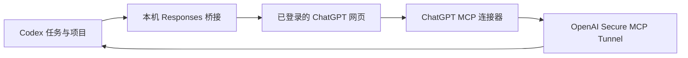

# codex-chatgpt-web：macOS 实践与配置适配

**已正式归档 · 探索结束于 2026-09-16。** 本仓库保留独有配置、实验结论与必要复现工具，不再继续功能开发。原项目仍由原作者维护，安装和更新请直接前往下方上游入口。
> 原项目由 **[miuuyy](https://github.com/miuuyy)** 及其贡献者开发。网页推理桥接、桌面启动器、MCP 完整工具回路等核心能力来自原项目，感谢作者的开放分享与持续维护。
>
> **[原作者仓库](https://github.com/miuuyy/codex-chatgpt-web) · [原作者安装与快速开始](https://github.com/miuuyy/codex-chatgpt-web#readme) · [原作者发布下载](https://github.com/miuuyy/codex-chatgpt-web/releases) · [原作者中文文档](https://github.com/miuuyy/codex-chatgpt-web/blob/main/README.zh-CN.md)**

**安装和更新始终走原作者入口。** 本仓库提供 macOS 使用经验、可选配置适配和验证工具，不重新发布原软件、安装包或替代安装器。先按上游文档使用；只有确实遇到这里记录的同类兼容问题，再参考相应适配。

**阅读本仓库：[配置适配与来源分工](docs/upstream-and-adaptations.md) · [接入过程](docs/implementation.md) · [验证结果](docs/validation.md) · [上下文取舍](docs/context-and-retirement.md)**

一次把 ChatGPT 网页订阅接到本机 Codex 的真实实验：**五档能完成开发，但无法满足 900k 上下文无压缩互切，最终在本机停止使用这条开发路径。** 本机的取舍针对长上下文无压缩互切需求，不代表原项目没有价值或不适合其他工作流。

本仓库公开部署方法、适配代码、验收方法及失败结果，帮助其他人判断是否适合自己的工作流。它是个人实验记录，不是上游官方发行版，也不承诺当前或未来网页兼容性。所有观察截止 **2026-09-16**。

## 结论先行

- Instant、Medium、High、Extra High、Pro 都完成过真实文件读取、原生补丁修改与测试。
- High 完成同一任务两轮开发；在独立 Codex home、故意无效的原生测试 key 条件下也通过，未配置失败后原生/付费回退。
- 桌面内置 app-server 与独立 CLI 是不同版本，必须分别验证。应用显示安装成功，不代表桌面已经加载网页模型。
- Pro 曾在保留网页的续接中丢失工具；重新建立网页后同一 Codex 任务恢复。不能把恢复成功说成根因已经修复。
- 网页 Pro 在本版本的默认实用压缩预算为 **95k**；开启实验性三倍上下文后为 **285k**。它不能与原生约 900k 的工作预算直接等同。
- 本机桌面二进制的离线切换实验显示：模拟 50k 用量可以直接从 Astra 切到 Web Pro；模拟 500k 时先向原生模型发起压缩。**全局 900k 压缩阈值不能阻止切换到较小窗口时的压缩。**
- 因此，本机已恢复原生 Codex 路由。后续方向是网页只读 MCP 做资料分析规划，原生 Codex 执行开发；新方案不属于本仓库的已完成验收结论。

## 上游和测试环境

| 项目 | 实际版本 |
| --- | --- |
| 上游 | [miuuyy/codex-chatgpt-web](https://github.com/miuuyy/codex-chatgpt-web) |
| 基线 | [v5.0.6](https://github.com/miuuyy/codex-chatgpt-web/releases/tag/v5.0.6)，e85e3693fdb4e3e033348c08df0298c20fcdb612 |
| 机器 | Apple Silicon Mac mini M4 / 32GB 内存 |
| 独立 Codex CLI | 0.154.0 |
| 桌面内置 Codex | 0.154.0-alpha.6.2 |
| 应用随附 Bun | 1.4.0 |
| 官方 tunnel-client | 0.0.12 |

源码、应用安装包、桌面随附 Codex 与终端里的 Codex 是不同对象。源码修改或普通 CLI 成功不会自动证明桌面版本已经生效。

## 这条路径是怎样工作的

网页承担推理，本机 Codex 执行文件、补丁、终端与测试。完整模式需要 Tunnel 和 ChatGPT 连接器；仅浏览器模式不能据此宣称具备开发工具能力。

## 阅读顺序

1. [接入方法与兼容问题](docs/implementation.md)：系统代理、固定路由、工具目录、桌面集成和撤销。
2. [验证结果与边界](docs/validation.md)：成功、失败、无效试验分别记录。
3. [上下文问题与退役决策](docs/context-and-retirement.md)：为什么 3× 不是 900k，以及如何恢复原生配置。
4. [ops/](ops/)：本次实验的独立维护入口和可复现实验脚本。

## 代码如何使用

`ops/` 是可选的本机配置与验收工具，不安装或替代原作者的桥接应用。其中 install-profiles/install-command/install-desktop 只处理本地适配；执行前先完成[原作者的安装](https://github.com/miuuyy/codex-chatgpt-web#readme)。本仓库不会在克隆后自动启用桥接。

Python 3.11+ 可运行管理入口和离线测试。真实接入还需要匹配的上游 macOS 应用、Codex、网页登录与 Tunnel。桌面探针使用本次机器实际存在的 `/Applications/ChatGPT.app/Contents/Resources/codex`；其他机器须按自己的安装路径调整。

离线管理回归：`python3 -m unittest discover -s ops -p 'test_*.py' -v`。

真实开发夹具：`python3 ops/acceptance/run.py`；桌面随附程序验收：`python3 ops/acceptance/desktop.py`。后者只启动独立 app-server，不操控当前桌面 UI。

`probe_context_switch.py` 使用假凭据、本机 HTTP 哨兵和模拟用量，不请求真实推理；它验证客户端切换行为，不能证明远端模型实际能处理相应长度。

## 公开范围

仅包含人工审阅过的说明、代码、合成测试夹具和汇总数字。没有 API key、Tunnel ID、账号令牌、模型目录原始快照、浏览器登录资料、完整会话、私人截图、原始运行日志或生产数据。

没有公开原始私有仓库历史；本仓库从清理后的材料新建。上游软件继续遵循[原作者许可证](https://github.com/miuuyy/codex-chatgpt-web/blob/main/LICENSE)；小范围上游补丁保留其[原始 MIT 版权声明](LICENSES/upstream-MIT.txt)。本仓库新增的工具与文档采用 [MIT](LICENSE)。
