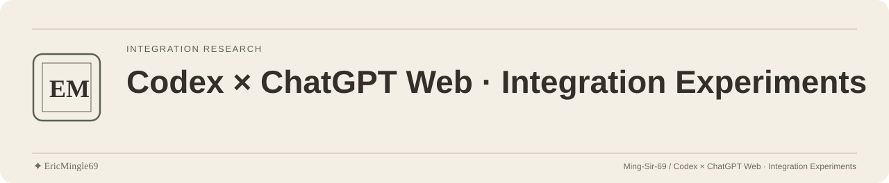

<picture>
  <source media="(prefers-color-scheme: dark)" srcset="readme-assets/header-dark.svg">
  <source media="(prefers-color-scheme: light)" srcset="readme-assets/header-light.svg">
  
</picture>

  <a href="README.md">简体中文</a> · <a href="README.en.md">English</a> · <a href="PERSONAL-NOTICE.md">✦ EricMingle69</a>

# Codex × ChatGPT Web · 集成实验

基于 **[miuuyy/codex-chatgpt-web](https://github.com/miuuyy/codex-chatgpt-web)** 的 macOS 配置适配与工程验证记录。
网页推理桥接、桌面启动器和 MCP 工具回路来自 miuuyy 及上游贡献者；本仓库记录可选适配与实验边界。

## 先安装上游，再选择适配

1. 按[原作者安装与快速开始](https://github.com/miuuyy/codex-chatgpt-web#readme)接入。
2. 阅读[来源与适配分工](docs/upstream-and-adaptations.md)。
3. 确有同类兼容问题时，再参考对应的配置工具。

安装和更新走上游入口；本仓库不重新发布原软件或提供替代安装器。

## 阅读路线

| 内容 | 入口 |
| --- | --- |
| 代理、路由、桌面集成与撤销 | [接入过程](docs/implementation.md) |
| 成功、失败及无效试验 | [验证结果](docs/validation.md) |
| 上下文预算与退役决定 | [上下文取舍](docs/context-and-retirement.md) |
| 配置管理与复现实验 | [维护与复现](docs/maintenance-and-reproduction.md) |
| 旧资料归并 | [合并说明](docs/consolidation.md) |
| 可选管理与验收工具 | [ops](ops/) |

## 历史结果怎么解读

观察截止 2026-09-16：Instant、Medium、High、Extra High、Pro 曾完成开发任务。
本机仍因长上下文无压缩互切需求恢复原生 Codex；历史成功不保证当前网页兼容。

Pro 的既有实用压缩预算为 95k，实验性 3× 为 285k，不能等同原生约 900k 工作预算。
源码、独立 CLI、桌面内置 app-server 与当前 UI 是不同验证对象。

## 复现条件

离线管理工具要求 Python 3.11+；真实接入另需匹配的上游应用、Codex、网页登录与 Tunnel。
先按[维护与复现文档](docs/maintenance-and-reproduction.md)检查版本与撤销路径，再选择实验。
不要上传登录资料、令牌或完整私人会话。

## 来源与许可

新增工具与文档采用 [MIT License](LICENSE)，Copyright (c) 2026 Ming-Sir-69。
上游软件遵循原作者许可；补丁保留[上游 MIT 声明](LICENSES/upstream-MIT.txt)，个人维护署名不替代原作者。

---

文档维护：**✦ EricMingle69** · [Ming-Sir-69](https://github.com/Ming-Sir-69)  
[个人标识、许可与权限说明](PERSONAL-NOTICE.md) · 明暗页眉随 GitHub 主题自动切换。
